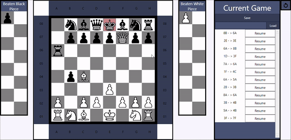

# Chess Game

A standard 8x8 chess game built using C#/WPF (.NET Framework 4.7.2).

## Rules

The game follows standard chess rules (see [Rules of Chess on Wikipedia](https://en.wikipedia.org/wiki/Rules_of_chess)).

### Excluded Rules and Features:

- **Timer**: No time limits are enforced during the game.
- **Pawn Moving Two Tiles**: Pawns can only move one tile at a time.
- **Resignation**: Players cannot formally resign.
- **Draw Conditions**: The game does not support draw conditions such as stalemate, threefold repetition, or the fifty-move rule.
- **Dead Position**: Scenarios where neither player can checkmate do not result in a draw.

**Note**: The game continues until one player checkmates the other, or it must be manually restarted.

## Game Features

### Save & Load

Players can save the current state of a game at any time by clicking the **Save** button. The game is saved as an XML file, located in the project directory under `\Chess\bin\Saved_Games\`. To **Load** a chess game file, you need to enter the name in the input field left to the Load button. Next, click the **Load** button to load the stored chess game.

### Resume

You can resume to a previously played game state by clicking the **Resume** button of a played moved from the **Current Game** box. This feature allows players to continue from where they left off.

### Reset

Clicking the reset button in the top-right corner immediately resets the game, clearing all current progress and starting a new game.

